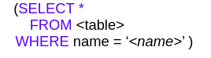

## Обеспечить измерение TPS и размер индекса для 3 индексов: HASH, BTree, BRIN

### Входные данные

- Создайте 3 таблицы со столбцами {id integer, name varchar}.
- Вставьте 100000 сгенерированных строк в каждую таблицу
- Создайте один тип индекса для одной таблицы для столбца

### Выходные данные

- размер для каждой индексной структуры
- сценарий эталонного тестирования в течение 300 секунд для 10 клиентов для SQL-запроса 
